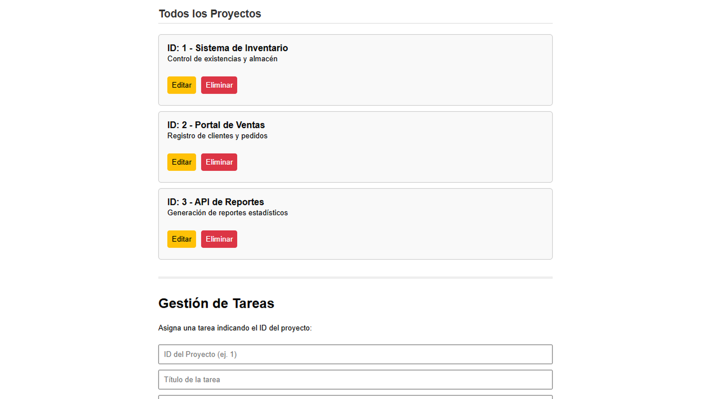
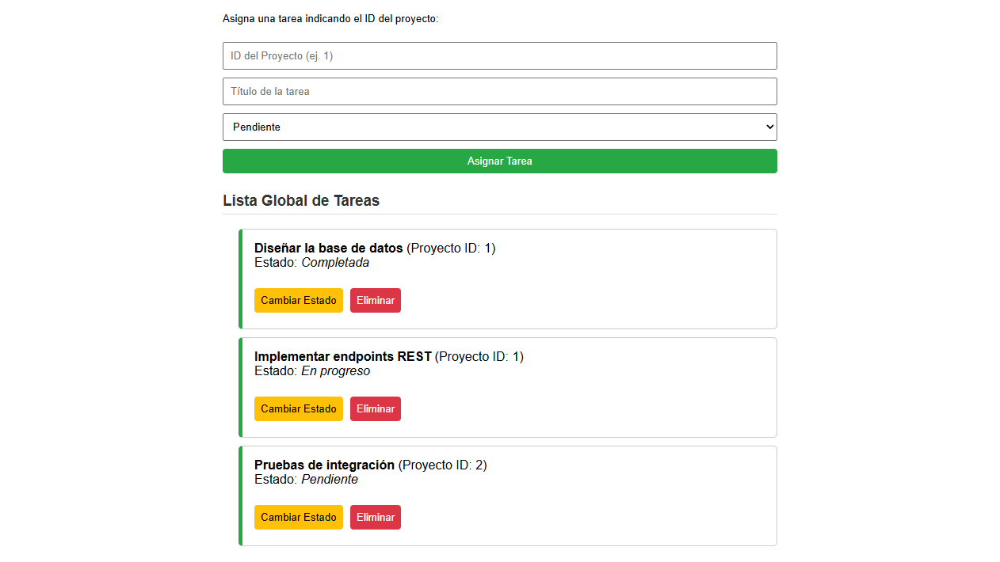

# 02. API REST para Gestión de Proyectos y Tareas

## Especificaciones Técnicas
* **Lenguaje de programación:** Python (v3.10 / v3.11) & JavaScript (ES6+)
* **Framework Web Backend:** Flask (v3.0)
* **Base de Datos:** SQLite3 (Motor de base de datos relacional embebido)
* **Lenguaje de Consultas:** SQL (Sentencias DDL y DML para tablas relacionales)
* **Frontend:** HTML5, CSS3, JavaScript Asíncrono (`fetch` API, `async/await`)
* **Herramientas de desarrollo:** VS Code, SQLite Viewer, Postman / Navegador Web.

---

## Descripción del Proyecto
Este proyecto consiste en el desarrollo de una aplicación web full-stack ligera basada en una arquitectura API RESTful, diseñada para la administración y control de proyectos con asignación de tareas dependientes.

El desarrollo abarca tres componentes fundamentales:

1. **Modelado y Gestión de Base de Datos (`app.py`):**
   * **Esquema Relacional:** Implementación de dos entidades interconectadas (`proyectos` y `tareas`) mediante la definición de claves primarias (`PRIMARY KEY AUTOINCREMENT`) y claves foráneas (`FOREIGN KEY`).
   * **Integridad de Datos:** Manejo explícito de conexiones, transacciones con `commit()` y cierre seguro mediante bloques `try-except-finally`.
   * **Prevención de Inyecciones SQL:** Uso estricto de parámetros posicionales (*placeholders* `?`) en todas las consultas.

2. **Endpoints de la API RESTful (`app.py`):**
   * **CRUD Completo:** Implementación de rutas HTTP para la entidad *Proyectos* y la entidad *Tareas*:
     * `POST /proyectos` & `POST /tareas`: Creación de registros serializando solicitudes en JSON (`request.json`).
     * `GET /proyectos` & `GET /tareas`: Consulta general de registros serializados a JSON (`jsonify()`).
     * `GET /proyectos/<id>` & `GET /tareas/<id>`: Búsqueda individual por identificador único.
     * `PUT /proyectos/<id>` & `PUT /tareas/<id>`: Actualización persistente de atributos.
     * `DELETE /proyectos/<id>` & `DELETE /tareas/<id>`: Eliminación segura de registros.

3. **Interfaz de Usuario Dinámica (`templates/index.html`):**
   * **Consumo de Servicios Web:** Interfaz SPA (*Single Page Application*) desarrollada con HTML5 y CSS3 que se comunica de forma asíncrona con el backend mediante `fetch()` sin recargar la página.
   * **Renderizado Dinámico:** Manipulación directa del DOM para dibujar la lista de proyectos, formularios de entrada, búsqueda por ID y gestión visual del estado de las tareas (*Pendiente*, *En progreso*, *Completada*).

---

## Imágenes

**Interfaz web: gestión de proyectos (CRUD completo)**


**Interfaz web: gestión de tareas**


---

## Instrucciones de Ejecución

1. Asegurarse de tener Python 3.x instalado.
2. Instalar el microframework Flask:
   ```bash
   pip install flask
